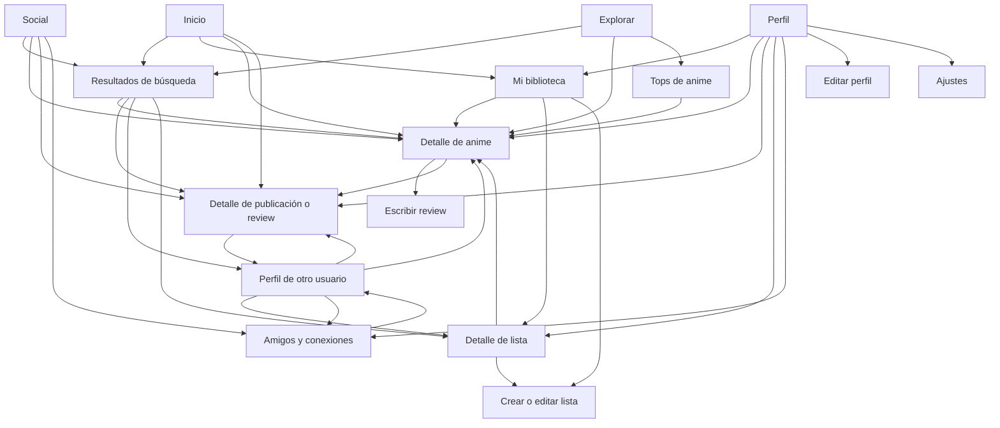
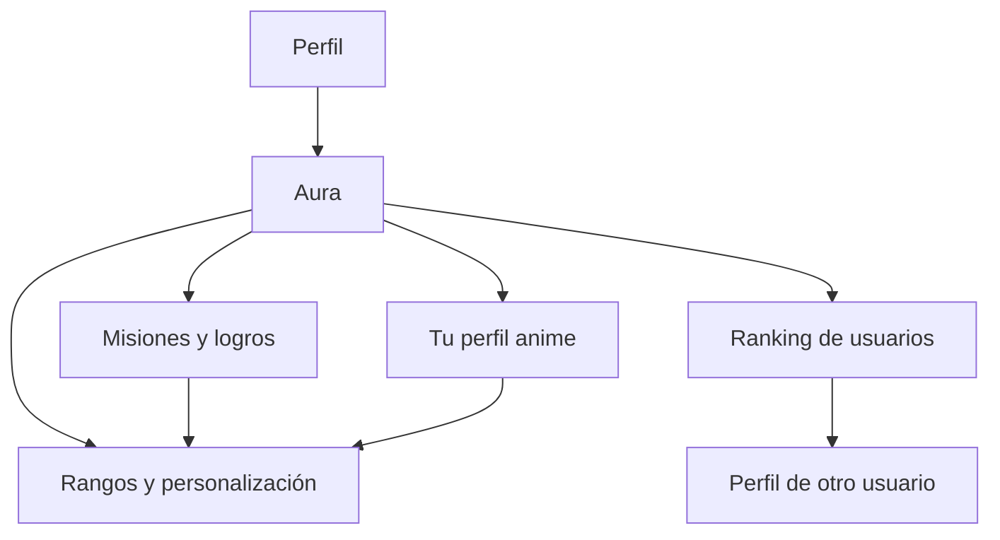
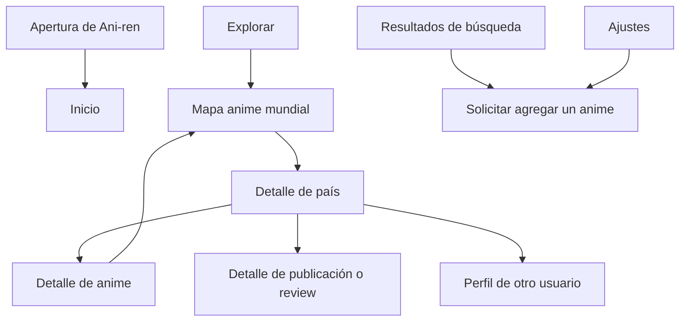

# Ani-ren — Plan de pantallas

Estado: las 24 pantallas navegables están implementadas en Expo, con datos de ejemplo y apertura estática configurada. Primera revisión web completada; pendiente revisión nativa en teléfono.

Revisión del 20/09/2026: se simplificó el código y se unificaron componentes y cálculos compartidos, manteniendo todas las rutas de este inventario y los comentarios `TODO BACKEND`.

Adaptación a computadora: todas las pantallas comparten una columna centrada de hasta 480 px, con barra inferior y diálogos ajustados. En ventanas angostas se usa el ancho disponible. La navegación y los formularios se pueden usar con mouse y teclado; los carruseles muestran su barra de desplazamiento en web.

Este archivo pertenece a frontend/. Los archivos de app/, src/ y assets/ son relativos a esa carpeta. La carpeta hermana backend/ está vacía y reservada para una etapa posterior. Para retomar, leer [INICIO_FRONTEND.md](INICIO_FRONTEND.md); los comandos de ejecución están en [README.md](README.md).

Este documento toma como referencia los seis mockups entregados, la guía de programación de los TPs y el boceto inicial de una aplicación de anime con reviews, colecciones, comunidad, Aura y estadísticas mundiales. El usuario confirmó incorporar todas las pantallas, incluidas las complementarias y las extensiones de Perfil.

La etapa actual comprende interfaz, navegación y estados visuales con datos de ejemplo. Usuarios, publicaciones, estadísticas, solicitudes y contenido de anime son simulados. La idea de IA se representa mediante un resultado de ejemplo identificado como tal.

## Inventario completo

El mapa comprende 24 pantallas navegables y una vista de apertura. Las rutas de esta tabla corresponden a los archivos TSX implementados dentro de frontend/.

| N.º | Vista | Archivo implementado |
| --- | --- | --- |
| 0 | Apertura de Ani-ren | Configuración de splash; sin ruta propia |
| 1 | Inicio | app/(tabs)/index.tsx |
| 2 | Explorar | app/(tabs)/explorar.tsx |
| 3 | Social | app/(tabs)/social.tsx |
| 4 | Aura | app/(tabs)/aura.tsx |
| 5 | Perfil | app/(tabs)/perfil.tsx |
| 6 | Detalle de anime | app/anime/[id].tsx |
| 7 | Resultados de búsqueda | app/busqueda.tsx |
| 8 | Mi biblioteca | app/biblioteca.tsx |
| 9 | Detalle de publicación o review | app/review/[id].tsx |
| 10 | Escribir o editar review | app/review/escribir.tsx |
| 11 | Perfil de otro usuario | app/usuario/[id].tsx |
| 12 | Editar perfil | app/editar-perfil.tsx |
| 13 | Ajustes | app/ajustes.tsx |
| 14 | Tops de anime | app/tops.tsx |
| 15 | Detalle de lista | app/lista/[id].tsx |
| 16 | Crear o editar lista | app/lista/editar.tsx |
| 17 | Comunidad: amigos y conexiones | app/comunidad.tsx |
| 18 | Misiones y logros | app/aura/misiones.tsx |
| 19 | Rangos y personalización Aura | app/aura/rangos.tsx |
| 20 | Ranking de usuarios | app/aura/ranking.tsx |
| 21 | Tu perfil anime: análisis Aura | app/aura/analisis.tsx |
| 22 | Mapa anime mundial | app/mapa/index.tsx |
| 23 | Detalle de país | app/mapa/[pais].tsx |
| 24 | Solicitar agregar un anime | app/solicitar-anime.tsx |

## Navegación principal

La barra inferior es compartida por las cinco pantallas principales y permanece fija al hacer scroll:

1. Inicio.
2. Explorar.
3. Social.
4. Aura.
5. Perfil.

El detalle de anime es una pantalla secundaria. Se abre desde la pantalla de origen y el botón Volver regresa a ella, conservando la tab seleccionada. No es una sexta tab.

Las demás pantallas secundarias también se abren sobre la navegación principal y tienen Volver. Las pestañas internas de biblioteca, búsqueda, comunidad y misiones no agregan opciones a la barra inferior.

## Apertura

### 0. Apertura de Ani-ren

Entrada: iniciar la aplicación.

Contenido: fondo carbón y logo o mascota centrados, con el nombre Ani-ren si corresponde a la composición elegida.

Se interpreta el opening como una apertura estática y breve, seguida de Inicio. No necesita una ruta propia ni una pantalla de acceso. La animación de la mascota o una introducción de varias páginas serían una ampliación posterior.

## Pantallas principales

### 1. Inicio

Referencia: Home.png. Ruta prevista: app/(tabs)/index.tsx.

Propósito: reunir descubrimiento de anime, actividad de amigos y accesos a la colección personal.

Orden del contenido:

- Saludo "Hola, Felipe 👋", subtítulo y avatar a la derecha.
- Buscador "Buscar anime, review o usuario".
- Últimas reviews de amigos: avatar, nombre, anime, comentario breve y puntuación.
- Populares esta semana: fila horizontal de posters con título y puntuación.
- Más rateados últimamente: segunda fila horizontal de anime.
- Actividad rápida: Watchlist, Vistos y Likes.

Conexiones: anime hacia su detalle; avatar hacia Perfil; buscador hacia Resultados de búsqueda; review hacia su lectura completa; Watchlist, Vistos y Likes hacia Mi biblioteca con el filtro correspondiente.

### 2. Explorar

Referencia: Explorar.png. Ruta prevista: app/(tabs)/explorar.tsx.

Propósito: descubrir anime por búsqueda, género, tendencias y temporada.

Orden del contenido:

- Título, descripción breve y avatar.
- Buscador.
- Explorar por género: Acción, Comedia, Fantasía, Romance y Ver todos.
- Mapa anime mundial: ilustración, explicación y leyenda de intensidad.
- Tendencias globales: fila horizontal de anime con posición y puntuación.
- Explorar por temporada: Primavera, Verano, Otoño e Invierno de 2026.

Conexiones: anime hacia su detalle; avatar hacia Perfil; buscador, género o temporada hacia Resultados de búsqueda; mapa hacia Mapa anime mundial; acceso a tops hacia Tops de anime. La vista previa del mapa conserva la composición del mockup; su pantalla ampliada simula las estadísticas.

### 3. Social

Referencia: Social.png. Ruta prevista: app/(tabs)/social.tsx.

Propósito: mostrar publicaciones y recomendaciones de la comunidad.

Orden del contenido:

- Título, descripción breve y avatar.
- Buscador de usuarios, publicaciones y anime.
- Filtros: Para ti, Siguiendo, Amigos y Global.
- Fila horizontal de avatares e historias.
- Feed de publicaciones con autor, tiempo, texto, anime o imagen, puntuación y acciones.

Conexiones: anime hacia su detalle; publicación o comentarios hacia Detalle de publicación o review; autor hacia Perfil de otro usuario; búsqueda hacia Resultados de búsqueda; acceso de amigos hacia Comunidad. Los filtros y likes muestran cambios locales. Las historias se presentan mediante un visor modal.

### 4. Aura

Referencia: AURA.png. Ruta prevista: app/(tabs)/aura.tsx.

Propósito: presentar el progreso, rango y objetivos del usuario.

Orden del contenido:

- Título Aura, descripción breve y avatar.
- Card del rango actual: insignia, nombre, progreso y beneficios.
- Rangos e insignias, con nombres iniciales Novato, Aprendiz, Experto, Maestro y Leyenda.
- Estadísticas generales: animes vistos, favoritos, reviews y progreso acumulado.
- Misiones destacadas con descripción, progreso y recompensa de ejemplo.
- Sufijo o badge actual y vista previa junto al nombre del usuario.
- Accesos a ranking de usuarios y descripción de gustos anime.

Conexiones: avatar hacia Perfil; Ver misiones hacia Misiones y logros; Ver rangos o personalizar hacia Rangos y personalización Aura; ranking hacia Ranking de usuarios; descripción de gustos hacia Tu perfil anime. Los detalles breves de una misión o insignia se presentan en un modal.

El nombre principal siempre es Aura. Misiones, logros, rangos, decoradores y análisis de gustos pertenecen a esta sección. El progreso y las recompensas son datos mock. El ranking compara cantidad de animes vistos; no se confunde con likes ni puntuaciones de reviews.

### 5. Perfil

Referencia: Perfil.png. Ruta prevista: app/(tabs)/perfil.tsx.

Propósito: mostrar la identidad del usuario, sus colecciones y su actividad.

Orden del contenido:

- Título Perfil y acciones superiores de compartir y ajustes.
- Avatar grande, nombre, handle, bio y badge o sufijo Aura.
- Estadísticas: Seguidores, Siguiendo, Reviews y Watchlist, conforme a los requisitos escritos.
- Card del rango Aura con progreso.
- Top 4 favoritos, en cuadrícula de dos columnas.
- Accesos a Watchlist, Vistos, Reviews y Listas.
- Actividad reciente.
- Reviews destacadas.
- Vistas internas de Reviews, Listas, Historial y Likes.

Conexiones: anime hacia su detalle; rango hacia Aura; colecciones hacia Mi biblioteca; lista hacia su detalle; review hacia su lectura completa; seguidores, siguiendo y amigos hacia Comunidad; edición hacia Editar perfil; ajustes hacia Ajustes.

El historial muestra fechas, anime marcado como visto y reviews escritas. Puede alternar Todo / Vistos / Reviews dentro de Perfil, sin una ruta adicional. Los tops personales se presentan mediante los favoritos destacados y las listas ordenadas del usuario.

## Ficha de anime

### 6. Detalle de anime

Referencia: Busqueda Anime.png. Ruta prevista: app/anime/[id].tsx.

Propósito: concentrar la información y las acciones relacionadas con un anime.

Orden del contenido:

- Volver y acciones superiores.
- Poster, título, título japonés, formato, año, estado, cantidad de episodios y duración por episodio.
- Puntuación general, total de votos, gráfico de barras con cantidad de usuarios por puntuación y selector de puntuación personal.
- Acciones: Escribir review, Watchlist, Visto y Favorito.
- Dónde verlo legalmente, con disponibilidad ilustrativa sin afirmar disponibilidad real.
- Sinopsis e información técnica.
- Personajes principales con imagen y descripción breve.
- Actores de voz, con nombre, personaje interpretado e idioma.
- Puntuaciones de amigos.
- Reviews destacadas.
- Noticias y novedades de ejemplo.
- Acceso a popularidad de este anime por país.

Conexiones: Volver hacia el origen; Escribir review hacia su formulario; review hacia su lectura completa; amigo hacia su perfil; popularidad por país hacia el mapa con el anime seleccionado. Watchlist, Visto, Favorito y puntuación muestran estados locales. Agregar a lista utiliza un selector modal de colecciones.

Personajes y actores de voz se incluyen en la ficha; un modal permite ampliar su información. Las plataformas se muestran como ejemplos; abrir un sitio legal puede ser una acción de enlace, sin una pantalla nueva.

Frieren será el caso inicial para validar la composición. Cuando se habiliten otras tarjetas, su destino deberá mostrar datos correspondientes al anime seleccionado.

La ficha usa scroll. En teléfonos estrechos, bloques de dos columnas pueden apilarse para mantener textos y controles legibles.

## Búsqueda, biblioteca y comunidad

Estas pantallas forman parte del alcance visual confirmado.

### 7. Resultados de búsqueda

Entrada: buscadores de Inicio, Explorar y Social; selección de un género o una temporada en Explorar.

Contenido: campo de búsqueda con el texto ingresado, filtros Anime / Reviews / Usuarios / Listas, resultados de ejemplo y estado sin resultados. Si se entra por género o temporada, mostrar ese contexto como título o filtro seleccionado.

Salidas: anime, review, usuario o lista hacia su detalle correspondiente; anime no encontrado hacia Solicitar agregar un anime. Volver regresa al origen. Un mismo diseño sirve para todos estos accesos.

### 8. Mi biblioteca

Entrada: Watchlist, Vistos y Likes de Inicio; accesos de colecciones en Perfil.

Contenido: título, selector Watchlist / Vistos / Favoritos / Listas / Likes, cantidad de elementos, búsqueda dentro de la colección y resultados. Abrir con el selector correspondiente al acceso utilizado. Contemplar estado vacío.

Favoritos reúne animes favoritos. Likes reúne reviews y publicaciones que gustaron al usuario. Listas muestra colecciones personalizadas, playlists de anime y tops personales; el término playlist se utiliza como colección de anime, no como reproductor de episodios.

Salidas: anime hacia su detalle; review hacia su lectura completa; lista hacia su detalle; Nueva lista hacia Crear o editar lista. Volver regresa al origen.

### 9. Detalle de publicación o review

Entrada: reviews de Inicio, Perfil y ficha de anime; publicaciones y comentarios de Social.

Contenido: autor, avatar, fecha, texto completo, imágenes, acciones de like, comentarios de ejemplo y campo para comentar con respuesta visual local. Mostrar anime y puntuación cuando se trate de una review; una publicación general puede carecer de esos datos. Las reviews con spoilers deben contemplar un aviso visual antes de revelar el texto.

Salidas: autor hacia perfil de otro usuario; anime hacia su detalle; review propia hacia su edición; Volver hacia el origen. Los comentarios permanecen en esta pantalla, sin una ruta adicional.

### 10. Escribir o editar review

Entrada: acción Escribir review del detalle de anime o Editar en una review propia.

Contenido: anime seleccionado, puntuación, campo de texto, fecha de visto, selector de spoilers y acciones Cancelar y Publicar o Guardar cambios. Contemplar formulario vacío, edición con campos completos, botón deshabilitado, teclado visible y confirmación simulada.

El texto se mantiene como borrador local durante la edición. Una confirmación visual no implica guardar ni publicar contenido real. Se propone una pantalla propia para dar espacio al formulario y al teclado.

### 11. Perfil de otro usuario

Entrada: autores de reviews o publicaciones; avatares de amigos; resultados de usuarios.

Contenido: avatar, nombre, handle, bio, estadísticas, rango Aura, favoritos, reviews, listas, historial y likes. Conservar la composición de Perfil propio y sustituir sus acciones personales por Seguir / Siguiendo y Agregar amigo, con estados visuales de solicitud pendiente y amistad de ejemplo.

Salidas: anime, review o lista hacia sus detalles; conexiones hacia Comunidad; Volver hacia el origen.

## Edición de perfil y ajustes

Estas dos pantallas también se incluyen en el mapa completo.

### 12. Editar perfil

Entrada: acción de edición en Perfil.

Contenido: vista previa del avatar, nombre, handle, bio, top de favoritos y botones Guardar / Cancelar. Un selector de anime permite organizar los favoritos destacados. Guardar simula la actualización local.

Al tocar el avatar se abre un panel con Tomar foto y Elegir de la galería. En esta etapa se dibujan el selector, la vista previa y las respuestas de cancelación o permiso no disponible. La captura real y la conexión con la galería se implementarán después. Los títulos y sufijos se seleccionan desde personalización Aura.

### 13. Ajustes

Entrada: icono de ajustes en Perfil.

Contenido: controles de tamaño de texto, ocultar spoilers, explicación de cámara y galería, información de Ani-ren y acceso a Solicitar agregar un anime. La identidad visual permanece oscura. Las preferencias son demostraciones locales; el contenido definitivo de cada opción se ajustará al implementar.

## Tops y listas personales

### 14. Tops de anime

Entrada: Explorar y sus accesos de tendencias o Ver todos.

Contenido: ranking de anime con puestos, posters, título y puntuación. Controles de período, género y criterio, por ejemplo Mejor puntuados / Más vistos / Más populares. Los valores y el orden inicial son datos de ejemplo; la fórmula de popularidad no se define en esta etapa.

Salidas: anime hacia su detalle; Volver hacia Explorar. Un top personal creado por un usuario es una lista ordenada y utiliza Detalle de lista.

### 15. Detalle de lista

Entrada: Mi biblioteca, búsqueda, Perfil propio o Perfil de otro usuario.

Contenido: título, descripción, autor, cantidad de animes, posters y orden. Una lista marcada como top muestra numeración; una playlist o colección utiliza el mismo diseño sin exigir ranking. Mostrar acciones de editar para el autor propio y una respuesta local de like.

Salidas: anime hacia su detalle; autor hacia su perfil; lista propia hacia Crear o editar lista; Volver hacia el origen.

### 16. Crear o editar lista

Entrada: Nueva lista en biblioteca o Editar en una lista propia.

Contenido: nombre, descripción, selector de lista ordenada, búsqueda de anime, elementos seleccionados y acciones para agregar, quitar, subir o bajar posiciones. Botones Guardar y Cancelar. No requiere arrastrar elementos ni una librería para hacerlo.

Estados: lista vacía, título faltante, anime ya agregado y vista previa de la lista. Guardar muestra un resultado simulado; no crea una colección remota.

## Amigos y conexiones

### 17. Comunidad: amigos y conexiones

Entrada: Social; contadores de seguidores o siguiendo y acceso de amigos en perfiles.

Contenido: pestañas internas Amigos / Seguidores / Siguiendo / Solicitudes, búsqueda de usuarios y filas con avatar, nombre, handle, rango y acción contextual. En el perfil propio, Solicitudes muestra ejemplos recibidos y enviados. En un perfil ajeno, solo mostrar las conexiones públicas de ejemplo.

Estados locales: seguir o dejar de seguir, solicitud pendiente, solicitud aceptada y listado vacío. Aceptar o rechazar solo cambia la vista de demostración.

Salida: usuario hacia su perfil; Volver hacia el origen. No se agrega mensajería privada.

## Desarrollo visual de Aura

### 18. Misiones y logros

Entrada: Ver misiones o logros en Aura.

Contenido: pestañas internas Misiones / Logros, cards con objetivo, categoría, progreso y recompensa decorativa. Ejemplos: ver una cantidad de anime, explorar un género o escribir reviews. Las cantidades son ilustrativas.

Estados: pendiente, en curso, completada; insignia obtenida y bloqueada. Un modal amplía requisitos y recompensa. Una misión completada puede demostrar la obtención de un badge sin recalcular progreso real.

Salida: recompensa hacia Rangos y personalización Aura; Volver hacia Aura.

### 19. Rangos y personalización Aura

Entrada: rango, insignias, sufijo actual o acción Personalizar desde Aura y Perfil.

Contenido: catálogo de rangos, títulos, sufijos, insignias y decoradores del avatar. Vista previa del nombre y perfil con la selección aplicada. Mostrar elementos disponibles, seleccionados y bloqueados.

Los nombres iniciales de rangos son Novato / Aprendiz / Experto / Maestro / Leyenda. La temática de sus nombres puede ajustarse sin cambiar el nombre de la sección Aura. Los sufijos como -kun son decorativos: se muestran en el nombre visible y no cambian automáticamente el handle del usuario.

El progreso al siguiente rango usa una cantidad de animes vistos de ejemplo. Los umbrales no son reglas definitivas. Las misiones y los títulos por gustos se presentan como formas diferentes de obtener decoradores, sin confundirlos con el ranking.

Salida: Volver hacia el origen. Seleccionar un decorador modifica su vista previa local.

### 20. Ranking de usuarios

Entrada: Aura; acceso contextual desde Comunidad.

Contenido: clasificación por cantidad de anime visto, filtros Global / Amigos, posición, avatar, nombre, cantidad y rango. Destacar la posición del usuario actual.

El orden utiliza valores mock. La definición de qué cuenta como un anime visto —serie, temporada o película— se resolverá antes de construir el cálculo real.

Salida: usuario hacia su perfil; Volver hacia el origen.

### 21. Tu perfil anime: análisis Aura

Entrada: card de gustos anime en Aura o Perfil.

Contenido: géneros predominantes, hábitos de ejemplo, descripción de gustos y un título sugerido. Un ejemplo de la idea del usuario es Sanji-kun para un perfil con muchas series de romance.

La pantalla muestra la etiqueta Resultado de ejemplo; IA no conectada. Un botón puede alternar entre ejemplos predeterminados, sin afirmar que se analizó el historial real. El título sugerido se previsualiza y puede seleccionarse como decorador de ejemplo.

Salida: personalización hacia Rangos y personalización Aura; Volver hacia el origen.

La IA futura describe afinidades y propone un estilo de perfil. No determina la posición del ranking por cantidad de animes vistos. El criterio de recomendación y desbloqueo se decidirá más adelante.

## Estadísticas por país

### 22. Mapa anime mundial

Entrada: vista previa del mapa en Explorar o acceso Popularidad por país de un anime.

Contenido: mapa con paleta oscura y escala violeta, leyenda y controles de métrica. Modos previstos: Cantidad de reviews / Anime más visto / Anime más popular / Vistos de un anime seleccionado. En el modo de un anime, mostrar selector y título del anime activo.

Los colores representan intensidades de ejemplo; cambiar de métrica o anime alterna conjuntos de datos mock. Mostrar puntos o países seleccionables y un selector accesible de país. La pantalla no necesita geolocalización ni un servicio cartográfico real para demostrar el recorrido.

Salidas: país hacia Detalle de país, conservando la métrica y el anime seleccionados; Volver hacia el origen.

### 23. Detalle de país

Entrada: selección de país en Mapa anime mundial.

Contenido: nombre del país, indicador de métrica elegida, estadísticas resumidas, top 5 del país y reviews locales de ejemplo. En el modo de anime seleccionado, mostrar cantidad de vistos de ese anime y su comparación ilustrativa con otros países.

Estados: país con actividad, país sin datos y cambio entre los conjuntos mock. Mostrar Datos de ejemplo para no confundir el boceto con estadísticas reales.

Salidas: anime hacia su detalle; review hacia su lectura completa; autor hacia su perfil; Volver hacia el mapa con sus controles conservados.

La fórmula de popularidad y el origen del país de cada usuario o review quedan pendientes para la etapa de datos. La interfaz distingue reviews, cantidad de vistos y popularidad.

## Solicitud de anime

### 24. Solicitar agregar un anime

Entrada: búsqueda sin el anime esperado, acción Anime no encontrado o Ajustes.

Contenido: título del anime, título alternativo opcional, enlace de referencia opcional y nota. Mostrar validación de título obligatorio, aviso de posible coincidencia con un resultado mock y botón Enviar solicitud.

Estados: formulario vacío, válido, incompleto, cancelación y confirmación Simulación: la solicitud no fue enviada. La recepción y revisión de solicitudes llegará con el backend. No se incorpora una pantalla de administración.

Salida: Volver o cerrar la confirmación regresa al origen.

## Interacciones que no necesitan otra pantalla

- Filtros Para ti / Siguiendo / Amigos / Global dentro de Social.
- Selector de puntuación y acciones Watchlist / Visto / Favorito dentro de la ficha.
- Orden y filtros avanzados como modal o panel dentro del listado.
- Información breve de un rango, misión, logro, personaje o actor de voz en un modal.
- Historias como visor modal.
- Comentarios dentro del detalle de publicación o review.
- Historial, reviews y likes personales como vistas internas de Perfil o biblioteca.
- Cámara o galería como selector y vista previa dentro de Editar perfil.
- Selector de anime para agregar a una lista o configurar favoritos.
- Elegir métrica, país o anime dentro de Mapa anime mundial.
- Compartir como acción o respuesta visual, sin una ruta propia.

## Recorridos visuales

Descubrimiento, colecciones y comunidad:

Aura:

Estadísticas y solicitud de anime:

Las cinco pantallas principales también se conectan entre sí mediante la barra inferior. Todas las secundarias incluyen Volver hacia su origen. Los diagramas muestran recorridos de entrada; no reemplazan los controles de regreso.

## Cobertura del boceto inicial

| Funcionalidad del boceto | Ubicación visual |
| --- | --- |
| Reviews y rating | Ficha de anime, detalle de review y escribir o editar review |
| Tops globales y personales | Tops de anime, favoritos de Perfil y listas ordenadas |
| Sinopsis, duración y plataformas legales | Detalle de anime |
| Personajes y actores de voz | Secciones de la ficha y modales de información |
| Barras de puntuación por cantidad de usuarios | Gráfico del detalle de anime |
| Watchlist, vistos, favoritos y playlists | Mi biblioteca, detalle de lista y crear o editar lista |
| Perfil con reviews, historial y likes | Vistas internas de Perfil y biblioteca |
| Amigos, seguir, likes y comentarios | Comunidad, perfiles, Social y detalle de publicación o review |
| Cámara y funciones del teléfono | Selector de avatar en Editar perfil; captura real posterior |
| Ranking por cantidad vista | Ranking de usuarios y rango Aura |
| Descripción de gustos con IA | Tu perfil anime, con resultado de ejemplo identificado |
| Etiquetas, sufijos e insignias | Rangos y personalización Aura, con vista previa en Perfil |
| Misiones y objetivos | Aura y Misiones y logros |
| Reviews por país y colores del mapa | Mapa mundial, control de métrica y Detalle de país |
| Top 5 de anime por país | Detalle de país |
| Popularidad de un anime entre países | Mapa en modo de anime seleccionado y comparación de ejemplo |
| Opening | Apertura estática de Ani-ren |
| Solicitud para agregar anime | Formulario accesible desde búsqueda y Ajustes |

Letterboxd funciona como referencia de experiencia. El alcance concreto de este mapa es el listado del usuario y las pantallas confirmadas; no se incorpora una copia indefinida de funciones no enumeradas.

## Reglas visuales compartidas

- Fondo carbón #0D0D12, superficies #17171F y #22222D.
- Texto principal #F5F2EA y secundario #A7A6B2.
- Violeta #8B5CF6, lavanda #A78BFA y violeta profundo #5B21B6.
- Coral #FF4D6D y #FF6B81 como acentos.
- Un único archivo src/theme.ts para colores, espaciados, radios y tamaños comunes.
- Márgenes, jerarquía de títulos, estilo de cards e iconos consistentes.
- Diseñar para teléfonos verticales de 320 a 430 px de ancho.
- Respetar Safe Area y mantener el contenido visible por encima de la barra inferior.
- El marco del teléfono, la hora y los indicadores dibujados en los mockups no forman parte de la interfaz de la app.
- Usar imágenes temporales cuando falten posters, avatares o ilustraciones independientes.
- Mantener la misma identidad y los mismos datos del usuario en Inicio, Aura y Perfil.
- Si se presentan puntuaciones sobre 10 y sobre 5, aplicar la misma conversión: 9,6/10 equivale a 4,8/5.

## Estados visuales que deben contemplarse

- Tab activa e inactiva.
- Campo de búsqueda vacío y con texto.
- Filtro seleccionado y sin seleccionar.
- Lista con resultados y estado sin resultados.
- Carga y error de consulta representados con ejemplos visuales, sin conectar un servidor.
- Like, favorito, visto y watchlist activos e inactivos.
- Puntuación personal sin seleccionar y seleccionada.
- Comentario vacío, con texto y agregado de forma simulada.
- Solicitud de amistad pendiente, aceptada y rechazada de forma local.
- Colección vacía, lista en edición y elemento ya agregado.
- Misión pendiente, en curso y completada; decorador bloqueado y seleccionado.
- País o métrica seleccionado, país sin datos y anime cambiado en el mapa.
- Formulario incompleto y confirmación de solicitud simulada.
- Selector de avatar, vista previa, cancelación y permiso no disponible.
- Modal abierto y cerrado cuando se utilice.
- Texto extenso e imágenes temporales o no disponibles.

Las interacciones son demostraciones locales. No se promete sincronización entre pantallas ni conservación de cambios al reiniciar la app en esta etapa.

## Criterio de implementación

Una pantalla importante corresponde a un archivo TSX. Los datos de ejemplo, las funciones simples y StyleSheet.create permanecen en ese archivo. Solo se extraen componentes cuando la repetición ya exista y simplifique la lectura.

Las fuentes de datos mock y las funciones de consulta o guardado que cambiarán al conectar el servidor llevarán comentarios TODO BACKEND. Su formato y los puntos de reemplazo se detallan en [INICIO_FRONTEND.md](INICIO_FRONTEND.md). Los estilos, filtros locales y controles de navegación mantienen su implementación de interfaz.

Orden de construcción seguido:

1. Tema, layouts y barra inferior; Inicio, Explorar, Social, Aura y Perfil.
2. Detalle de anime, búsqueda y biblioteca.
3. Reviews, perfiles de usuarios, comunidad, tops y listas.
4. Misiones, rangos, personalización, ranking y ejemplo de análisis Aura.
5. Mapa mundial y detalle de país.
6. Editar perfil, ajustes, solicitud de anime y apertura estática.

Todas las vistas están en el alcance visual. El orden permite revisar identidad y navegación en grupos manejables, conservando una pantalla importante por archivo y funciones simples.

Verificación inicial: TypeScript, lint, versiones compatibles con Expo y exportación Android/iOS/web. En navegador se comprobaron las 24 rutas a 320, 390 y 430 px, controles Volver, estados vacíos y seleccionados, IDs inválidos y validaciones de formularios. Las capturas y resultados están en frontend/artifacts/. Queda revisar teclado, Safe Area y apertura en un teléfono físico; generar bundles no sustituye esa revisión.

El trabajo actual implementa la interfaz y sus respuestas locales. Este mapa no incorpora autenticación, backend, APIs, persistencia, chat ni notificaciones reales. Las fórmulas de ranking, los umbrales de rangos, los criterios de IA, la disponibilidad de plataformas y las métricas por país siguen siendo ejemplos. Las colecciones y relaciones iniciales se comparten desde src/mock.ts para conservar coherencia sin sincronizar las modificaciones locales.
